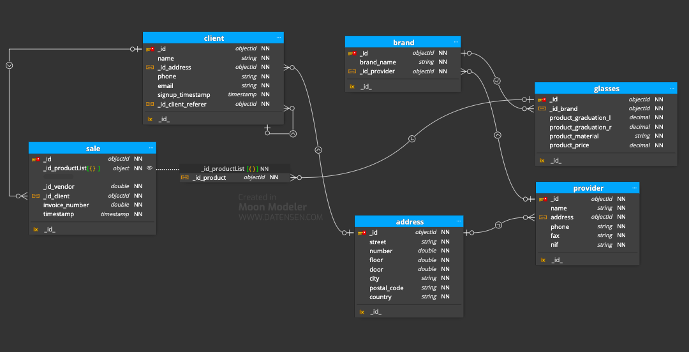
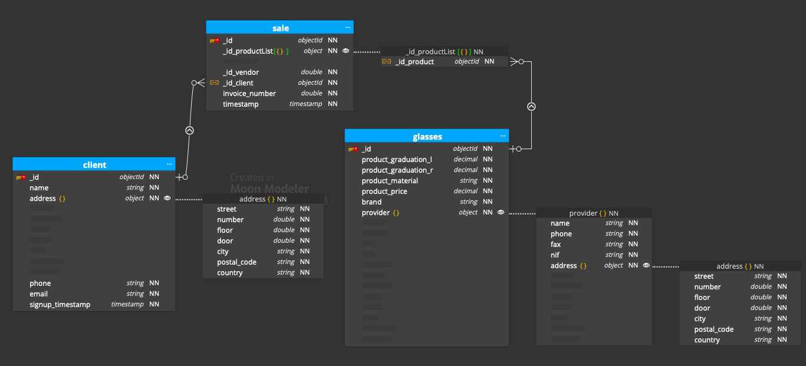
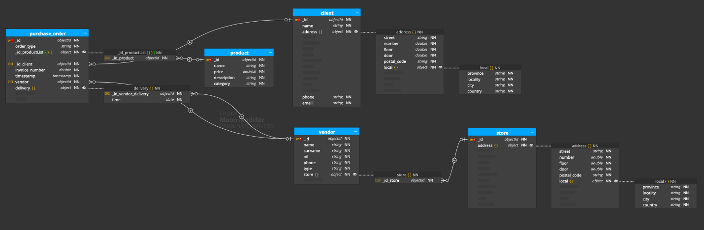
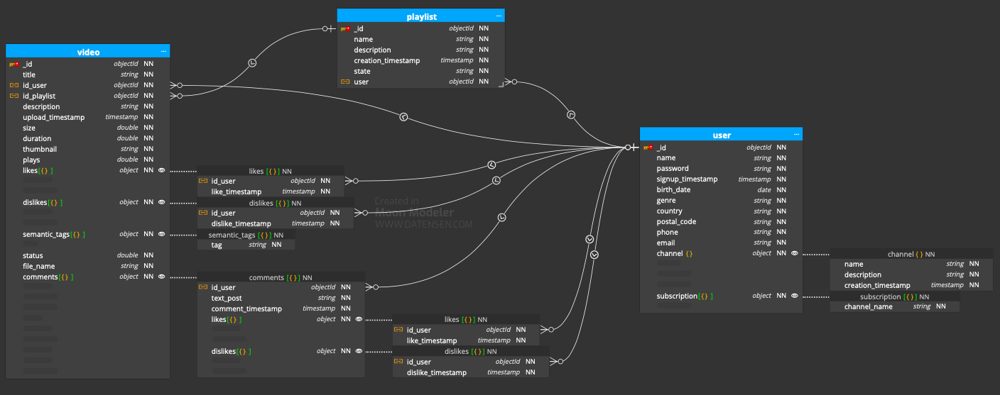

# Sprint2_T3_MongoDB_Data_Structure

Reading summary: **[task](https://github.com/plopezgit/Sprint2_T3_MongoDB_Data_Structure/issues/1#issue-1949444101)**

Level 1

Exercise 1

An optician wants to computerize customer management and glasses sales.

_Solution 1: Reference relational model (strict validation scheme):_

_Solution 2: Enmbedded objects model:_

First of all, the optician wants to know the supplier of each of the glasses. Specifically, you want to know about each supplier:

- Name.
- The address (street, number, floor, door, city, postal code and country).
- Phone.
- Fax.
- NIF.

The optician's purchasing policy is based on the fact that glasses from one brand will be purchased from a single supplier (this way you can get better prices), but they can buy glasses from several brands from one supplier. About the glasses he wants to know:

- The brand.
- The graduation of each of the crystals.
- The type of frame (floating, paste or metallic).
- The color of the frame.
- The color of each crystal.
- The price.

From clients you want to store:

- Name.
- The postal address.
- The phone.
- The email.
- The registration date.

When a new customer arrives, store the customer who has recommended the establishment (as long as someone has recommended you).

Our system must indicate who the employee who sold each eyeglass was.

Exercise 2

You have been hired to design a website that allows you to order food at home online.

Take into account the following indications to model what the project database would be like.

For each client we store a unique identifier:

- Name.
- Surnames.
- Address.
- Postal Code.
- Location.
- Province
- Phone number

The locality and province data will be stored in separate tables. We know that a locality belongs to a single province and that a province can have many localities. A unique identifier and name are stored for each location. In each province we store a unique identifier and a name.

One person can place many orders, but a single order can only be placed by a single person. A unique identifier is stored for each order:

- Date hour.
- If the order is for home delivery or to pick up in store.
- The number of products that have been selected of each type.
- The total price.

An order can consist of one or more products.

The products can be pizzas, hamburgers and drinks. A unique identifier is stored for each product:

- Name.
- Description.
- Image.
- Price.

In the case of pizzas, there are several categories that can change names throughout the year. A pizza can only be in one category, but a category can have many pizzas.

A unique identifier and name are stored for each category. An order is handled by a single store and one store can handle many orders. A unique identifier is stored for each store:

- Address.
- Postal Code.
- Location.
- Province.

Many employees can work in one store and one employee can only work in one store. For each employee, a unique identifier is stored:

- Name.
- Surnames.
- NIF.
- Phone.

If you work as a cook or delivery person. For home delivery orders, it is important to save who the delivery person is who delivers the order and the date/time of delivery.

Level 2

Exercise 1

We will try to make a simple model of what the database would be like for a reduced version of YouTube.

We store a unique identifier for each user: 

- E-mail.
- Password.
- Username.
- Birthdate.
- Sex.
- Country.
- Postal Code.

A user publishes videos. For each video we save a unique identifier:

- A title.
- A description.
- A size.
- The name of the video file.
- Video length. 
- A thumbnail. 
- The number of reproductions.
- The number of likes.
- The number of dislikes.

A video can have three different states: public, hidden and private.
A video can have many tags. 
A tag is identified by a unique identifier and a tag name.
It is interesting to save who the user is who publishes the video and what date/time they do so.

A user can create a channel. A channel has a unique identifier:

- A name.
- A description.
- A creation date.

A user can subscribe to other users' channels.
A user can like or dislike a video only once.
It will be necessary to keep a record of the users who have liked and disliked a certain video and what date/time they did so.

A user can create playlists with the videos that she likes. Each playlist has a unique identifier:

- A name.
- A creation date.
- A status indicating that it can be public or private.

A user can write comments on a given video. Each comment is identified by a unique identifier:

- The text of the comment.
- The date/time it was done.

A user can like or mark a comment.

I don't like. A record will need to be kept of the users who have liked/disliked a comment, and what date/time they did so.

Level 3

Exercise 1

We will try to make a simple model of what the database needed for Spotify would be like.

{soon}

There are two types of users: free and premium. 

We store a unique identifier for each user:
- Email.
- password.
- Username.
- Birthdate.
- Sex.
- Country.
- Postal Code.

Premium users make subscriptions. The necessary data that must be saved for each subscription is:

- Subscription start date.
- Service renewal date.

A form of payment, which can be by credit card or PayPal.
For credit cards we store the card number, month and year of expiration and the security code. For users who pay with PayPal, we save the PayPal username. We are interested in keeping a record of all the payments that a premium user has made during the period they are subscribed to. 

From each payment is saved:
- The date.
- An order number (which is unique).
- A total.

A user can create many playlists. From each playlist we save:
- A title.
- The number of songs it contains.
- A unique identifier.
- A creation date.

When a user deletes a playlist it is not deleted from the system, but rather it is marked as having been deleted. This way the user can recover her playlists in case they have deleted them by mistake. It is necessary to store the date on which the playlist was
been marked as deleted.

We can say that there are two types of playlists: active and deleted. A playlist that is active can be shared with other users, this means that other users can add songs to it. In a shared list we are interested in knowing which user added each song and on what date they did so.

A song can only belong to a single album. An album can contain many songs. An album has been published by a single artist. An artist may have published many albums. For each song we save a unique identifier:

- A title.
- A duration.
- The number of times it has been played by Spotify users.
- For each album we save a unique identifier:
- Qualification.
- Year of publication.
- An image with the cover.

We keep a unique identifier for each artist:
- Name.
- An image of the artist

A user can follow many artists. An artist can be related to other artists who make similar music. So Spotify can show us a list of artists related to the artists we like. We are also interested in saving a user's favorite albums and songs. 

A user can select many albums and many songs as favorites.
